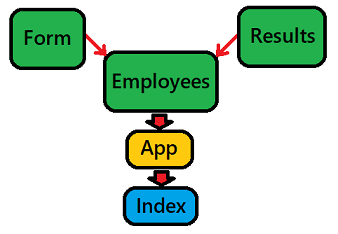
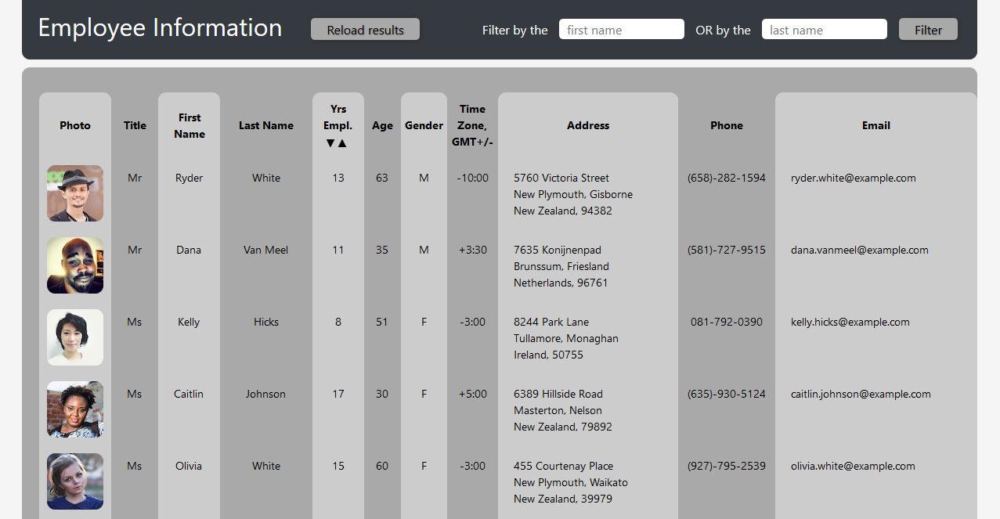
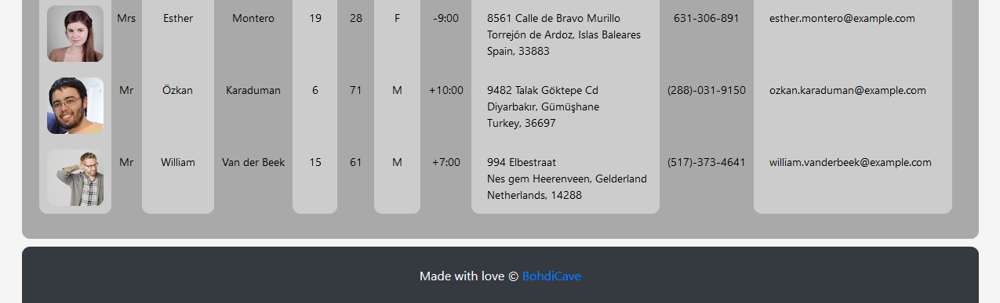
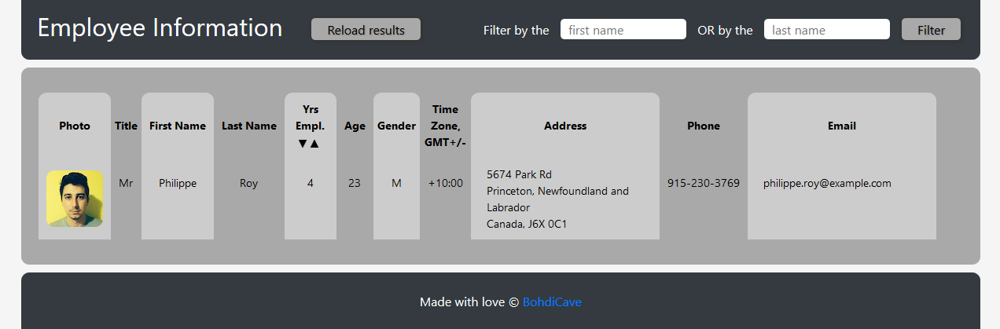
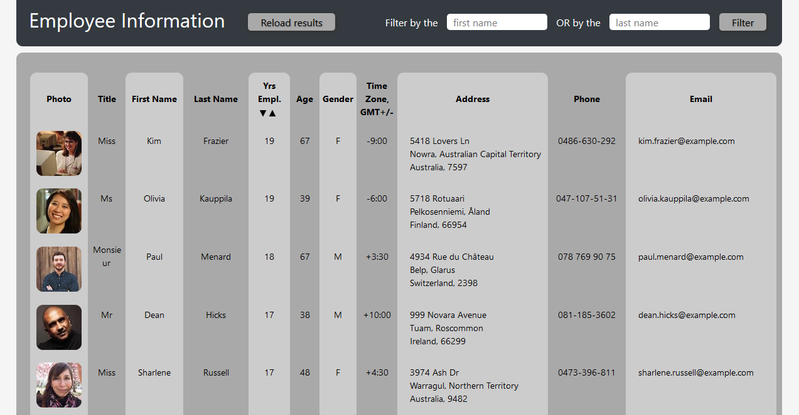

# Reactive-Directive

A React.js app providing an easy way to access employee information

## Features

* Components 

    

* State management 
* Props 
* [Random User API](https://randomuser.me/) to generate mock user data
* Axios package to make API requests  
* Filtering based on either first or last name ("Reload results" button to return to the full list) 
* Sorting based on years employed - ascending or descending (buttons are conveniently located in the table header) 

## Some potential venues for future development

* Add login functionality to secure the information 
OR
* Use only the basic information - names, photos, etc., no sensitive data (contacts, DOB and so on)
* Add search and filters based on multiple criteria
* More extensive sorting or more general querying capability

## Screenshots

## Filtered results: 

## Sorted (descending): 

## Link to the deployed app

[https://bohdicave.github.io/Reactive-Directive](https://bohdicave.github.io/Reactive-Directive)

# Create React App details

This project was bootstrapped with [Create React App](https://github.com/facebook/create-react-app).

## Available Scripts

In the project directory, you can run:

### `npm start`

Runs the app in the development mode.\
Open [http://localhost:3000](http://localhost:3000) to view it in the browser.

The page will reload if you make edits.\
You will also see any lint errors in the console.

### `npm test`

Launches the test runner in the interactive watch mode.\
See the section about [running tests](https://facebook.github.io/create-react-app/docs/running-tests) for more information.

### `npm run build`

Builds the app for production to the `build` folder.\
It correctly bundles React in production mode and optimizes the build for the best performance.

The build is minified and the filenames include the hashes.\
Your app is ready to be deployed!

See the section about [deployment](https://facebook.github.io/create-react-app/docs/deployment) for more information.

### `npm run deploy` (with the `predeploy` script)

The `predeploy` script simply contains the previous command - `npm run build`, to ensure that a new build is run prior to each deployment. `npm run deploy` runs the command `gh-pages -d build`, creating an optimized and minified version of the app on the "gh-pages" branch and making the app available on GitHub Pages (provided the settings have been set up accordingly).

### `npm run eject`

**Note: this is a one-way operation. Once you `eject`, you can’t go back!**

If you aren’t satisfied with the build tool and configuration choices, you can `eject` at any time. This command will remove the single build dependency from your project. Instead, it will copy all the configuration files and the transitive dependencies (webpack, Babel, ESLint, etc) right into your project so you have full control over them. All of the commands except `eject` will still work, but they will point to the copied scripts so you can tweak them. At this point you’re on your own. 

Please keep in mind that, most likely, you won't have to use this command ever. 

## Learn More

You can learn more in the [Create React App documentation](https://facebook.github.io/create-react-app/docs/getting-started). To learn React, check out the [React documentation](https://reactjs.org/).

* Code Splitting - [https://facebook.github.io/create-react-app/docs/code-splitting](https://facebook.github.io/create-react-app/docs/code-splitting)
* Analyzing the Bundle Size - [https://facebook.github.io/create-react-app/docs/analyzing-the-bundle-size](https://facebook.github.io/create-react-app/docs/analyzing-the-bundle-size)
* Making a Progressive Web App - [https://facebook.github.io/create-react-app/docs/making-a-progressive-web-app](https://facebook.github.io/create-react-app/docs/making-a-progressive-web-app)
* Advanced Configuration - [https://facebook.github.io/create-react-app/docs/advanced-configuration](https://facebook.github.io/create-react-app/docs/advanced-configuration)
* Deployment - [https://facebook.github.io/create-react-app/docs/deployment](https://facebook.github.io/create-react-app/docs/deployment)
* `npm run build` fails to minify - [https://facebook.github.io/create-react-app/docs/troubleshooting#npm-run-build-fails-to-minify](https://facebook.github.io/create-react-app/docs/troubleshooting#npm-run-build-fails-to-minify)
